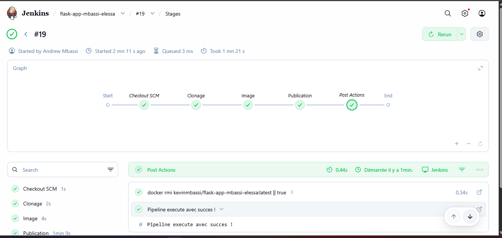

# 🐳 Flask App — Mbassi Elessa
### CC1 · Conduite de Projet · AGILE / DEVOPS / KANBAN
**KEYCE Informatique & Intelligence Artificielle — M1 IABD**

---

## 📁 Structure du projet

```
Flask_app/
├── app.py                          # Application Flask avec frontend designé
├── Dockerfile                      # Image Docker Python 3.9-slim
├── requirements.txt                # Dépendances Python (Flask)
├── historiques_commandes_TP1.txt   # Historique des commandes TP1
├── Capture_app_flask.png           # Capture de l'application Flask
├── jenkins/
│   ├── Jenkinsfile                 # Pipeline CI/CD Jenkins (TP2)
│   └── Capture_pipeline.png        # Capture du pipeline exécuté
└── pritunl-vpn/                    # TP3 Docker Compose
    ├── docker-compose.yml          # Orchestration Pritunl + MongoDB
    ├── .env                        # Variables d'environnement
    └── volumes/
        ├── pritunl/                # Données persistantes Pritunl
        └── mongodb/                # Données persistantes MongoDB
```

---

## TP1 — Docker (Dockerfile, Image, Conteneur)

### Objectifs
1. Comprendre les concepts de base de Docker : Dockerfile, image, conteneur
2. Créer un Dockerfile pour déployer une application Flask
3. Construire une image Docker
4. Exécuter un conteneur à partir de cette image

### Prérequis
- Docker installé sur la machine
- Connaissance de base en ligne de commande

### Lancer l'application

```bash
# 1. Construire l'image
docker build -t franciskago-flask-app .

# 2. Lancer le conteneur
docker run -d -p 5000:5000 --name franciskago-container franciskago-flask-app

# 3. Vérifier que le conteneur tourne
docker ps

# 4. Accéder à l'application
# Ouvrir dans le navigateur : http://localhost:5000
```

### Aperçu de l'application


### Image DockerHub
🔗 [kevinmbassi/flask-app-mbassi-elessa](https://hub.docker.com/r/kevinmbassi/flask-app-mbassi-elessa)

```bash
# Télécharger et lancer depuis DockerHub
docker pull kevinmbassi/flask-app-mbassi-elessa:latest
docker run -d -p 5000:5000 kevinmbassi/flask-app-mbassi-elessa:latest
```

---

## TP2 — CI/CD Jenkins

### Objectif
Automatiser le build et le push de l'image Docker via un pipeline Jenkins en 3 étapes.

### Pipeline

| Étape | Description | Statut |
|---|---|---|
| **Clonage** | Clone app.py et requirements.txt depuis GitHub | ✅ |
| **Image** | Construit l'image Docker | ✅ |
| **Publication** | Publie l'image sur DockerHub | ✅ |

### Installer et lancer Jenkins

```bash
docker run -d \
  --name jenkins \
  -p 8080:8080 \
  -p 50000:50000 \
  -v jenkins_home:/var/jenkins_home \
  -v /var/run/docker.sock:/var/run/docker.sock \
  jenkins/jenkins:lts
```

Accès interface Jenkins : **http://localhost:8080**

### Aperçu du pipeline exécuté


---

## TP3 — Docker Compose (Pritunl VPN + MongoDB)

### Objectif
Mettre en place un serveur VPN Pritunl complet avec base MongoDB en utilisant Docker Compose, avec configuration réseau, volumes persistants et sécurisation de l'accès.

### Prérequis

```bash
# Vérifier le module tun (nécessaire pour le VPN)
lsmod | grep tun

# Si absent
sudo modprobe tun
```

### Lancer les services

```bash
cd pritunl-vpn

# Lancer MongoDB + Pritunl
docker-compose up -d

# Vérifier les conteneurs
docker ps
```

### Arrêter les services

```bash
docker-compose down
```

### Services déployés

| Service | Image | Port | Rôle |
|---|---|---|---|
| **Pritunl** | jippi/pritunl:latest | 443, 80, 1194/udp | Serveur VPN |
| **MongoDB** | mongo:5.0 | 27017 (interne) | Base de données |

Interface admin Pritunl : **https://localhost**

---

## TP4 — Gestion de projet (Trello & Jira)

### Trello
- Tableau Kanban : **"Mbassi Elessa — Projet DevOps"**
- 4 colonnes : `Backlog` · `En cours` · `Terminé` · `Bloqué`
- Tâches des 4 TPs réparties selon leur avancement

### Jira
- Projet Scrum : **"Mbassi Elessa"**
- 13 tâches couvrant les 4 TPs
- Statuts : `À faire` · `En cours` · `Terminé`

---

## 👨‍💻 Auteur

**Mbassi Elessa** · M1 IABD · KEYCE Informatique & Intelligence Artificielle
